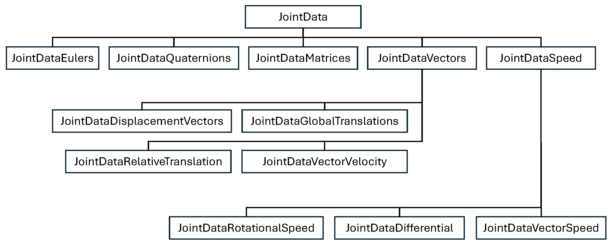

# Joint Data Classes

Joint Data classes are used to store sequences of joint rotations for single or multiple joints in a numpy array. The data can be access and interpreted in variety ways via class functions.  Different joint data classes support different functionality, the diagram below shows how different joint data types inherit from one another.



The table below shows the axis labels of each data type and whether it has a getDifferenceBetweenFrames() function to support measuring motion similarity and dynamic time warping modules. It also shows the method used to extract the joint data from the FBX file: directly reading keyframes (K), sampling the animation curve(S), or derived from another joint class(J).

| Class Name          | Description                                                     | Axis                                        | Supports Difference Function | Extraction Method |
|---------------------|-----------------------------------------------------------------|---------------------------------------------|----|----|
| JointDataEulers     | Euler rotation                                                  | x, y, z                                     |                   | K  |
| JointDataQuaternions | Quaternion rotation                                             | x, y, z, w                                  | X                 | K  |
| JointDataMatrices   | Matrix rotational transform                                     | m00, m01, m02, m10, m11, m12, m20, m21, m22 |                   | K  |
| JointDataDisplacementVectors | A unit length vector in the direction of the joints rotation    | x, y, z                                     | X                 | K  |
| JointDataGlobalTranslation | Joint position in global space                                  | x, y, z                                     | X                 | S  |
| JointDataRelativeTranslation | Joint position within the local space of another joint          | x, y, z                                     | X                 | S  |
| JointDataVectorVelocity | Velocity or differential of joint belonging to the JointDataVector class | x, y, z                                     | X                 | J  |
| JointDataRotationalSpeed | Speed of a joints rotation in degrees per frame                 | s                                           | X                 | K  |
| JointDataDifferential | Differential of joint belonging to JointDataSpeed class         | $\Delta s$                                  | X                 | J  |
| JointDataVectorSpeed | Speed of joint belonging to the JointDataVector class           | s                                           | X                 | J  |

## JointData class

## Properties

| Name       | Data Type   | Description                                                                                                                                   |
|------------|-------------|-----------------------------------------------------------------------------------------------------------------------------------------------|
| axisLabels | String List | Labels for axes used to parameterize the joint data.                                                                                          |
| axes       | Class       | Enumeration class containing labels of the axes used to parameterize the joint data.                                                          |
| joints     | String List | A list of joints contained in the joint data.  Specified using standardised joint names in the FBXMotionToolkit.joint class.                  |
| dataType | String      | Type of joint representation used by joint data.                                                                                              |
| data | Numpy Array | Motion data in the form of joint parameters.  Data is stored in a three dimensional numpy array of the following shape (joints, axes, frames). |

## Functions

### getJointCount
> int jointDataClass.getJointCount()

Returns the number of joints represented by the joint data.

Example:
```
jointCount = myJointData.getJointCount()
```

### getAxisCount
> int jointDataClass.getAxisCount()

Returns the number of axes used to parameterize each joint.

Example:
```
axisCount = myJointData.getAxisCount()
```

### getFrameCount
> int jointDataClass.getFrameCount()

Returns the number of frames or samples contained in the joint data.

Example:
```
frameCount = myJointData.getFrameCount()
```

### checkHasDifferenceFunction
> boolean jointDataClass.checkHasDifferenceFunction()

Returns True if the joint data class being used supports the getDifferenceBetweenFrames() function for measuring the difference between joint poses.  Otherwise, the function returns False.  Refer to the table at the top of the page for more information about which joint classes support the getDifferenceBetweenFrames() function.

Example:
```
myBool = myJointData.checkHasDifferenceFunction()
```

### checkMatchingFrameCount
> myBool = boolean jointDataClass.checkMatchingFrameCount(targetJointData)

Returns True if the target joint data has the same number of frames as the joint data the function is being called on.  Otherwise, function will return False.

Parameters:

| Name            | Data Type                | Description                                  |
|-----------------|--------------------------|----------------------------------------------|
| targetJointData | Joint Data Class | Target joint data object to compare against. |

Example:
```
myBool = inputJointData.checkMatchingFrameCount(targetJointData)
```

### checkMatchingJointCount
> boolean jointDataClass.checkMatchingJointCount(targetJointData)

Returns True if the target joint data is representing the same number of joints as the joint data the function is being called on.  Otherwise, function will return False.

Parameters:

| Name            | Data Type                | Description                                  |
|-----------------|--------------------------|----------------------------------------------|
| targetJointData | Joint Data Class | Target joint data object to compare against. |

Example:
```
myBool = inputJointData.checkMatchingJointCount(targetJointData)
```
### checkMatchingClass
> boolean jointDataClass.checkMatchingClass(targetJointData)

Returns True if the class of target joint data matches that of joint data the function is being called on.  Otherwise, function will return False.

Parameters:

| Name            | Data Type                | Description                                  |
|-----------------|--------------------------|----------------------------------------------|
| targetJointData | Joint Data Class | Target joint data object to compare against. |

Example:
```
myBool = inputJointData.checkMatchingClass(targetJointData)
```

### getJointAxisData
> floatList jointDataClass.getJointAxisData(joint, axis)

Returns the values for every frame in a specified joint axis.

Parameters:

| Name  | Data Type | Description                                       |
|-------|-----------|---------------------------------------------------|
| joint | String    | The name of the joint to retrieve joint data from |
| axis  | String    | The name of the axis to retrieve joint data from  |

Example:
```
axisData = jointDataClass.getJointAxisData(fmt.joint.rhip, jointDataClass.axes.x)
```

### getJointAxisFrameValue
> float jointDataClass.getJointAxisFrameValue(joint, axis, frame)

Returns the value of a specified joint axis at a given frame.

Parameters:

| Name  | Data Type | Description                                      |
|-------|----------|--------------------------------------------------|
| joint | String   | The name of the joint to retrieve joint data from |
| axis  | String   | The name of the axis to retrieve joint data from |
| frame | Int      | The frame number to retrieve joint data from     |

Example:
```
jointAxisValue = jointDataClass.getJointAxisFrameValue(fmt.joint.rhip, jointDataClass.axes.x, 100)
```

### getJointFrameData
> floatList jointDataClass.getJointFrameData(joint, frame)

Returns the axes values of a specified joint at a given frame.

Parameters:

| Name  | Data Type | Description                                      |
|-------|----------|--------------------------------------------------|
| joint | String   | The name of the joint to retrieve joint data from |
| frame | Int      | The frame number to retrieve joint data from     |

Example:
```
jointAtFrame = jointDataClass.getJointFrameData(fmt.joint.rhip, 100)
```

### getJointData
> numpyArray jointDataClass.getJointData(joint)

Returns a two dimensional numpy array of joint parameters for a given joint.  The array is in the shape (axes, frames).

Parameters:

| Name  | Data Type | Description                                       |
|-------|----------|---------------------------------------------------|
| joint | String   | The name of the joint to retrieve joint data from |

Example:
```
jointData = jointDataClass.getJointData(fmt.joint.rhip)
```

### getFlatJointData
> numpyArray jointDataClass.getFlatJointData()

Returns all the joint data in a flatterned two dimensional numpy array of shape (axes, frames).  All axes of a given joint are listed in the order that they appear in jointDataClass.axisLabels, before the axes of the next joint.

Example:
```
flatternedJointData = jointDataClass.getFlatJointData()
```

### exportJointDataCSV
> void jointDataClass.exportJointDataCSV(filePath)

Exports the joint data to a .csv file.

Parameters:

| Name     | Data Type | Description                                      |
|----------|----------|--------------------------------------------------|
| filePath | String   | The path and name of the .csv file to be created |

Example:
```
jointDataClass.exportJointDataCSV('jointData.csv')
```

### plotJointData
> void jointDataClass.plotJointData(joint)

Plots a graphs of a given joints parameters (axes) over time (frames).

Parameters:

| Name     | Data Type | Description                               |
|----------|----------|-------------------------------------------|
| joint | String   | The name of the joint to plot a graph for |

Example:
```
jointDataClass.plotJointData(fmt.joint.rhip)
```

## JointDataQuaternions class

inherits JointData class

### getDifferenceBetweenFrames
> float jointDataQuaternions.getDifferenceBetweenFrames(jointList, inputMotionFrame, targetMotionJointData, targetMotionFrame)

Returns the difference between two frames from jointDataQuaternions objects based on the difference between joint rotations. The difference between the two is based on a geodesic distance between 0 and 1. 1 = pointing in opposite directions, 0 = pointing the same direction.

Parameters:

| Name     | Data Type            | Description                                                                               |
|----------|----------------------|-------------------------------------------------------------------------------------------|
| jointList    | StringList           | List of joints, specified using standardised joint names in FBXMotionToolkit.joint class. |
| inputMotionFrame  | Int                  | A frame within the joint data the function is being called on.                            |
| targetMotionJointData  | jointDataQuaternions | The joint data object containing the target motion.                                       |
| targetMotionFrame  | Int                  | A frame within the joint data of the target motion.                                       |

Example:
```
dif = jointQuaternions1.getDifferenceBetweenFrames(joints, 0, jointQuaternions2, 0)
```

### getJointsAsRotationalSpeed
> jointDataRotationalSpeed jointDataQuaternions.getJointsAsRotationalSpeed()

Calculates the rotational speed of each joint in a jointQuaternionData object, returning the results as joint data in a jointDataRotationSpeed object.

Example:
```
motionSpeed = jointQuaternions.getJointsAsRotationalSpeed()
```

## JointDataMatrices class

inherits JointData class

### getJointFrameDataAsMatrix
> numpyArray jointDataMatrices.getJointFrameDataAsMatrix(joint, frame)

Retrieves the oreintation of a joint at a given frame as a rotational matrix in the form of a 3 x 3 numpy array.

Parameters:

| Name  | Data Type | Description                                      |
|-------|----------|--------------------------------------------------|
| joint | String   | The name of the joint to retrieve joint data from |
| frame | Int      | The frame number to retrieve joint data from     |

Example:
```
matrix = jointMatrices.getJointFrameDataAsMatrix(fmt.joint.rhip, 0)
```

### getJointDataAsMatrix
> numpyArray jointDataMatrices.getJointDataAsMatrix(joint)

Retrieves all the frames for a given joint as a series of rotational matrices in the form a numpy array with the shape (frame, 3, 3).

Parameters:

| Name  | Data Type | Description                                      |
|-------|----------|--------------------------------------------------|
| joint | String   | The name of the joint to retrieve joint data from |

Example:
```
matrix = jointMatrices.getJointDataAsMatrix(fmt.joint.rhip)
```

## JointDataVectors class

inherits JointData class

### getDistanceBetweenFramesAsVector
> numpyArray jointDataVector.getDistanceBetweenFramesAsVector(joint, inputMotionFrame, targetMotionJointData, targetMotionFrame)

Returns the difference between two frames, of a specified joint, from jointDataVector objects as a 3D translational vector, in the form of a numpy array of shape (3).

Parameters:

| Name    | Data Type        | Description                                                                          |
|---------|------------------|--------------------------------------------------------------------------------------|
| joint   | String           | A joint specified using a standardised joint name from FBXMotionToolkit.joint class. |
| inputMotionFrame | Int              | A frame within the joint data the function is being called on.                       |
| targetMotionJointData | jointDataVectors | The joint data object containing the target motion.                                  |
| targetMotionFrame | Int              | A frame within the joint data of the target motion.                                  |

Example:
```
# calculate velocity of joint at the start of motion.
vector = jointVectors.getDistanceBetweenFramesAsVector(fmt.joint.rhip, 0, jointVectors, 1)
```

### getDifferenceBetweenFrames
> float jointDataVectors.getDifferenceBetweenFrames(jointList, inputMotionFrame, targetMotionJointData, targetMotionFrame)

Returns the difference between two frames from jointDataVectors objects as the distance between the two vectors.

Parameters:

| Name     | Data Type        | Description                                                                               |
|----------|------------------|-------------------------------------------------------------------------------------------|
| jointList    | StringList       | List of joints, specified using standardised joint names in FBXMotionToolkit.joint class. |
| inputMotionFrame  | Int              | A frame within the joint data the function is being called on.                            |
| targetMotionJointData  | jointDataVectors | The joint data object containing the target motion.                                       |
| targetMotionFrame  | Int              | A frame within the joint data of the target motion.                                       |

Example:
```
dif = jointVectors1.getDifferenceBetweenFrames(joints, 0, jointVectors2, 0)
```

### getJointVectorsAsSpeed
> jointDataVectorSpeed jointDataVectors.getJointVectorsAsSpeed()

Calculates the speed of each joint in a jointDataVectors object, based on the magnitude of the difference between vectors in adjacent frames.  Results are returned as joint data in a jointDataVectorSpeed object.

Example:
```
motionSpeed = jointVectors.getJointVectorsAsSpeed()
```

### getJointVectorsAsVelocityVectors
> jointDataVectorVelocity jointDataVectors.getJointVectorsAsVelocityVectors()

Calculates the directional velocity of each joint in a jointDataVectors object, based on the difference between vectors in adjacent frames.  Results are returned as joint data in a jointDataVectorVelocity object.

Example:
```
jointSpeeds = jointVectors1.getJointVectorsAsVelocityVectors()
```

## JointDataSpeed class

inherits JointData class

### getDifferenceBetweenFrames
> float jointDataSpeed.getDifferenceBetweenFrames(jointList, inputMotionFrame, targetMotionJointData, targetMotionFrame)

Returns the difference between two frames from jointDataSpeed objects as the absolute difference between their speeds.

Parameters:

| Name     | Data Type            | Description                                                                               |
|----------|----------------------|-------------------------------------------------------------------------------------------|
| jointList    | StringList           | List of joints, specified using standardised joint names in FBXMotionToolkit.joint class. |
| inputMotionFrame  | Int                  | A frame within the joint data the function is being called on.                            |
| targetMotionJointData  | jointDataQuaternions | The joint data object containing the target motion.                                       |
| targetMotionFrame  | Int                  | A frame within the joint data of the target motion.                                       |

Example:
```
dif = jointSpeeds1.getDifferenceBetweenFrames(joints, 10, jointSpeeds2, 10)
```

### getJointsAsDifferentials
> jointDataDifferential jointDataSpeed.getJointsAsDifferentials()

Calculates the differentials between the values of each adjacent frame, returning the results as joint data in a jointDataDifferential object.

Example:
```
motionSpeed = jointQuaternions.getJointsAsRotationalSpeed()
jointAcceleration = motionSpeed.getJointsAsDifferentials()
```