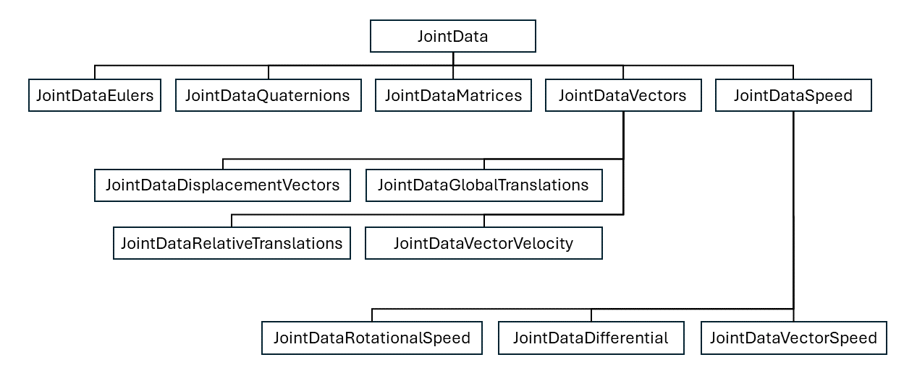

## Joint Data Classes

Joints Data classes are used to store sequences of joint rotations for multiple joints in a numpy array. The data can be access and interpreted in variety ways via class functions.  Different joint data classes support different functionality, the diagram below shows how different joint data types inherit from one another.

The table below shows the axis or each data type and whether it has a getDifferenceBetweenFrames() function to support measuring motion similarity and dynamic timewarping modules.